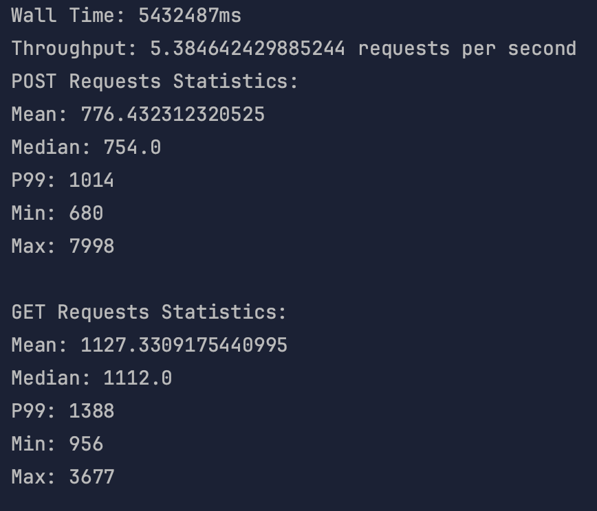
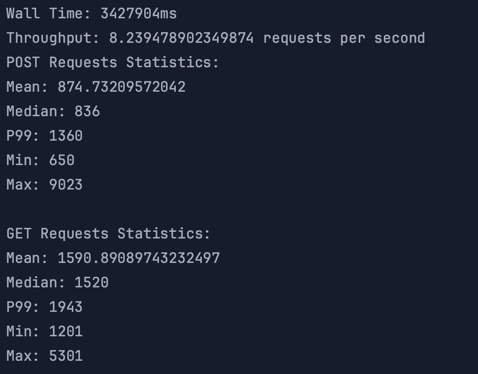
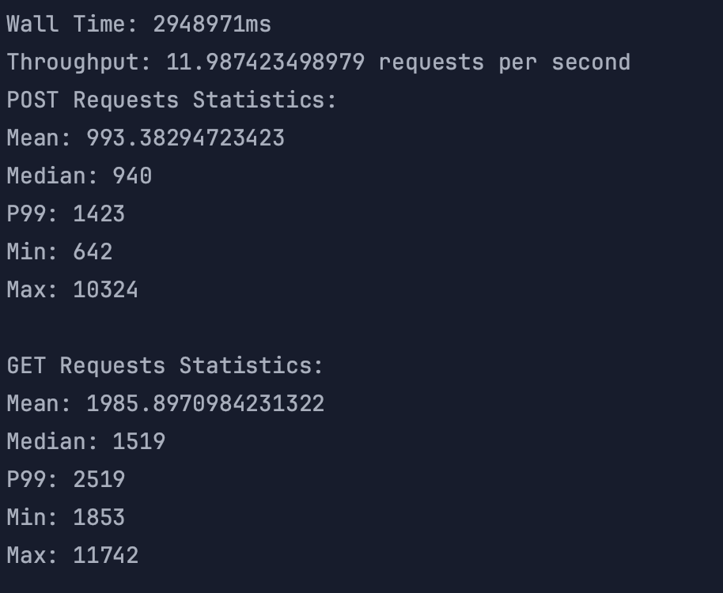

# MusicAlbums Assignment 2

## Introduction

For this assignment, we are required to integrate with database and server load balancer.The database will be used to store the data of the music albums. 
The server load balancer will be used to distribute the load to the servers. For database, I chose RDS Postgres because it is easy to use and the data model
is simple and fixed. For server load balancer, I chose AWS Elastic Load Balancer because it is easy to use and it is free.

## Database Model
```
TABLE albums (
    id SERIAL PRIMARY KEY,
    image BYTEA,
    artist VARCHAR(255),
    title VARCHAR(255),
    year INT
);
```
As we can see, the id is auto-incremented, thus for creating new albums, we do not 
need to specify the id. The image is stored as byte array. The artist, title and year
are stored as string, string and integer respectively, which are fetched and transformed
from doPost() request.

## Load Testing

### 1. Load Testing without Load Balancer(single server)

#### 1.1. threadGroupSize = 10, numThreadGroups = 10, delay = 2
#### 1.2. threadGroupSize = 10, numThreadGroups = 20, delay = 2
#### 1.3. threadGroupSize = 10, numThreadGroups = 30, delay = 2


### 2. Load Testing with Load Balancer(2 servers)

#### 2.1. threadGroupSize = 10, numThreadGroups = 10, delay = 2
#### 2.2. threadGroupSize = 10, numThreadGroups = 20, delay = 2
#### 2.3. threadGroupSize = 10, numThreadGroups = 30, delay = 2


### 3. Load Testing with Load Balancer(2 servers) and Database Configuration Tuning

Database Configuration Tuning:
- I upgraded the database server to a higher tier, which has more memory and CPU.

#### 3.1. threadGroupSize = 10, numThreadGroups = 30, delay = 2


### Results Comparison Table for 30 numThreadGroups
                  single server    |   2 servers   |   2 servers + Tuning
    WallTime   |      1:30:05      |   0:57:11     |       0:49:13
    Throughput |       5.38        |     8.24      |        11.99
    Get() Mean |       1127        |     1590      |        1985
    Get() p99  |       1388        |     1943      |        2519
    Get() Mid  |       1112        |     1520      |        1519
    Get() Max  |       3677        |     5301      |        11742
    Get() Min  |       956         |     1201      |        1853
    Post() Mean|       776         |     874       |        993
    Post() p99 |       1014        |     1360      |        1423
    Post() Mid |       754         |     836       |        940
    Post() Min |       680         |     650       |        642  
    Post() Max |       7998        |     4023      |        10324