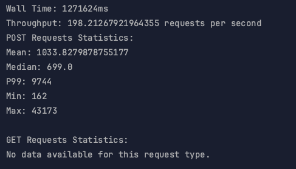
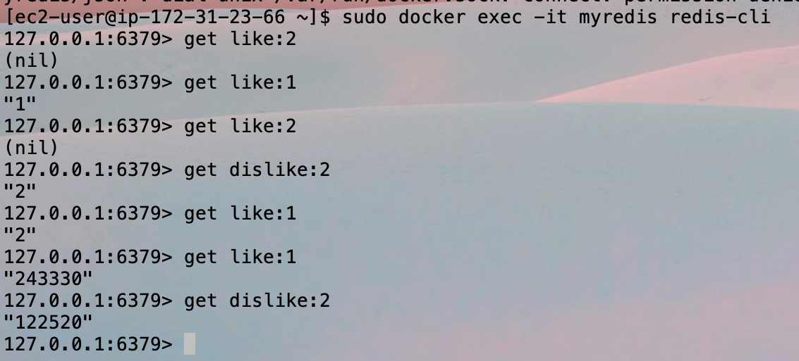

# MusicAlbums Assignment 3
Author: Luhan Wen
Date: 2023-12-3

## Introduction

For this assignment, we are required to integrate with message queue to support asynchronous request processing. The 
use case is 'review' - like and dislikes from users for albums. Thus, firstly, we need to create a new servlet in Server
pkg to handle the review request. Secondly, we need to modify the Client pkg to send the review request together with
load testing. Thirdly, we need to integrate with RabbitMQ to support asynchronous request processing. Lastly, for the
likes and dislikes storage, we would love to use Redis for its fast read and write speed.

For the configurations, we would use one node for RabbitMQ, one node for Consumer, and one node for the Server and Redis. 
The workflow is as follows:
1. rabbitmq node starts [done]
2. consumer node starts [done]
3. redis node starts [done]
4. server node starts [done]
5. local client send request to server, including album get request and album review request [done]
6. server node send the review request to rabbitmq node [done]
7. consumer node receives the review request from rabbitmq node [done]
8. consumer node send the review request to redis node [done]


## Database Model
- Postgre
```
TABLE albums (
    id SERIAL PRIMARY KEY,
    image BYTEA,
    artist VARCHAR(255),
    title VARCHAR(255),
    year INT
);
```
As we can see, the id is auto-incremented, thus for creating new albums, we do not 
need to specify the id. The image is stored as byte array. The artist, title and year
are stored as string, string and integer respectively, which are fetched and transformed
from doPost() request.

- Redis
```
Key pattern is "like:[albumId]" or "dislike:[albumId]"
```

## Load Testing with single server
Here in the below is the best performance I can get with single server. There are some things I done to improve the
performance:
1. Use `Redis` to store the likes and dislikes, which is much faster than Postgre
2. Once I noticed the queue size getting larger and became the bottleneck, I `increased the consumer thread size` until 
the queue size is close to zero
3. Upgrade my related hardware to `t2.medium` to get better performance

#### - Client output


#### - RMQ screenshot


#### - Redis validation screenshot
